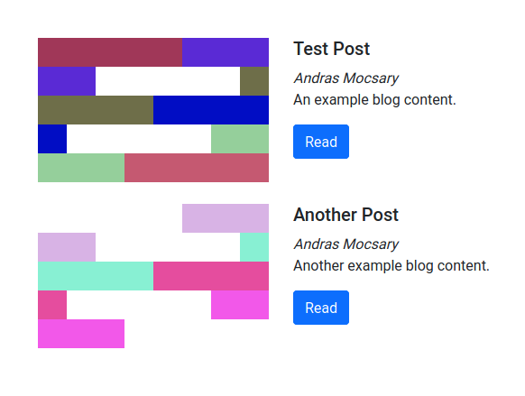

# A blog engine with `api_derive`

```rust
#![forbid(unsafe_code)]
```

## Getting started
This is a REST RUST LFCRUD API and blog engine.

### Easy to use
The `Post` struct is declared in `model.rs`. Enjoy the full capabilities of [serde](https://serde.rs) and [Keats/validator](https://github.com/Keats/validator) derives.

### CRUD REST API
All of the **LFCRUD** endpoints are derived for a Post.
An example [Actix Web 2.0](https://github.com/actix/actix-web) app configuration is provided in `route.rs`.

### Open API specification
Run `cargo test` to generate an *Open API 3* specification. It is built on [oas_gen](https://github.com/element114/oas_gen).

### Gateway configuration
This example doesn't come with any access or permission checks, throttling or any other similar features.
It is designed to be hidden behind an API gateway.

Use [krakend_conf](https://gitlab.com/reed-wolf/krakend_conf) to generate a [Krakend ultra performant api gateway](https://github.com/devopsfaith/krakend) endpoint configuration.

### Using HTML templates
The `/posts` endpoint renders a [Bootstrap 5](https://github.com/twbs/bootstrap/tree/v5.0.0-alpha1) html template. It is build at compile time with [djc/askama](https://github.com/djc/askama), which is a `jinja2` / `twig` / `liquid` like template toolkit, with more limitations in exchange for performance.

The pages are mounted in the `pages` *mod* and the `askama` templates are placed into the `templates` directory.

Feel free to tinker with them.

### Working with ArangoDB
Most of the DB interaction was build with the [arangoq](https://github.com/element114/arangoq) query builder. Take a look of what it is capable of, and star it to keep the contributors encouraged.

## How to run the example application
### Start the db
Local Cluster mode:
```bash
export HOST_IP=<your_host_ip_here>
docker volume create arangodb1
docker run -it --name=adb1 --rm -p 8528:8528 \
-v arangodb1:/data \
-v /var/run/docker.sock:/var/run/docker.sock \
arangodb/arangodb-starter \
--starter.address=$HOST_IP \
--starter.local
```

An alternative way to start a single instance to test if something would work in non-cluster mode as well.
``` bash
docker run -e ARANGO_ROOT_PASSWORD=test_password -e ARANGODB_OVERRIDE_DETECTED_TOTAL_MEMORY=2G -e ARANGODB_OVERRIDE_DETECTED_NUMBER_OF_CORES=2 -p 8529:8529 -d arangodb
```

Go to <http://localhost:8529> and setup your test db.
```
DB_NAME=test_dev
DB_CONN=http://localhost:8529
ARANGO_PASSWORD="test_dev_pw"
ARANGO_USER_NAME=test_dev
```

Stop and remove the docker container. Note: if you keep the volume, you keep the db data.
```bash
docker container ls -a
docker container stop [container_id]
docker container rm [container_id]

docker stop $(docker ps -aq)
docker rm $(docker ps -aq)
docker rmi $(docker images -q)
```

### Setup test data
- Naivgate to http://localhost:8529/
- Create a new db and user with password
- Complete .env with test data
- Fill the DB

# Final Note
Most of the Rust crates mentioned on this page or used in this example are looking for contributions. Don't forget to take a look at them if you feel like helping out.
And remember: Even a star can help.
